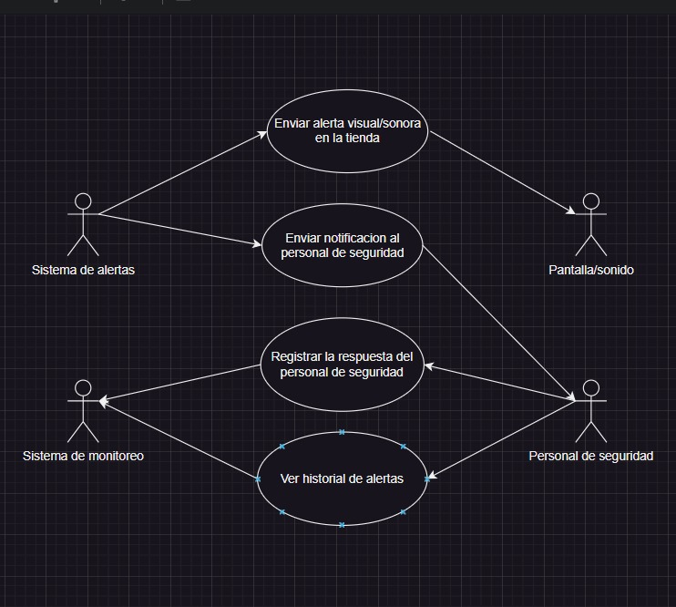

## Diagrama de Casos de Uso: Gestión y Administración
Este diagrama describe las interacciones del administrador con el sistema de monitoreo. A través de una interfaz de administración, los responsables pueden acceder al sistema con credenciales, configurar parámetros como la sensibilidad del modelo de detección y consultar los registros de detecciones almacenados en la base de datos. También pueden generar reportes para evaluar el cumplimiento de las normativas sanitarias e incluso excluir a ciertos empleados o personal autorizado del sistema de detección, asegurando una gestión flexible y eficiente del monitoreo.

