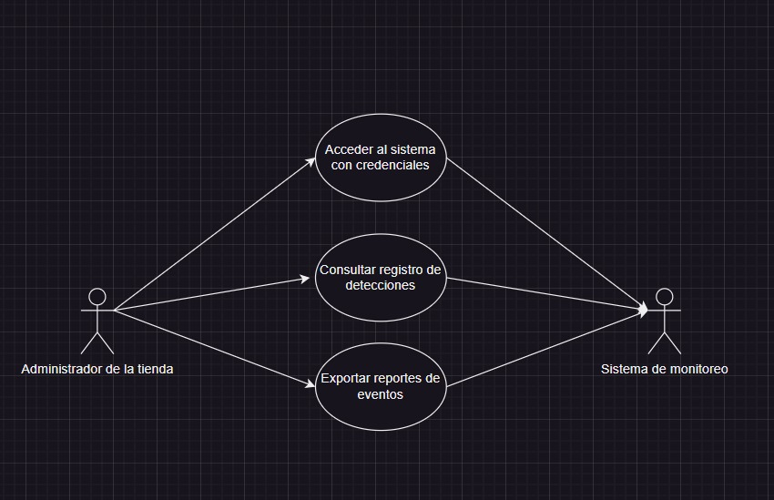

## Diagrama de Casos de Uso: Notificación y Respuesta
Este diagrama detalla el proceso de notificación y respuesta ante eventos de detección de personas sin mascarilla. Cuando el sistema de monitoreo identifica un caso, se activa el sistema de alertas para generar una notificación visual o sonora en la entrada del hospital. Simultáneamente, se envía una notificación al personal de seguridad para que tomen las acciones correspondientes. El personal de seguridad también puede registrar su respuesta en el sistema, lo que permite llevar un historial de incidentes y evaluar la efectividad de las medidas de seguridad implementadas.

